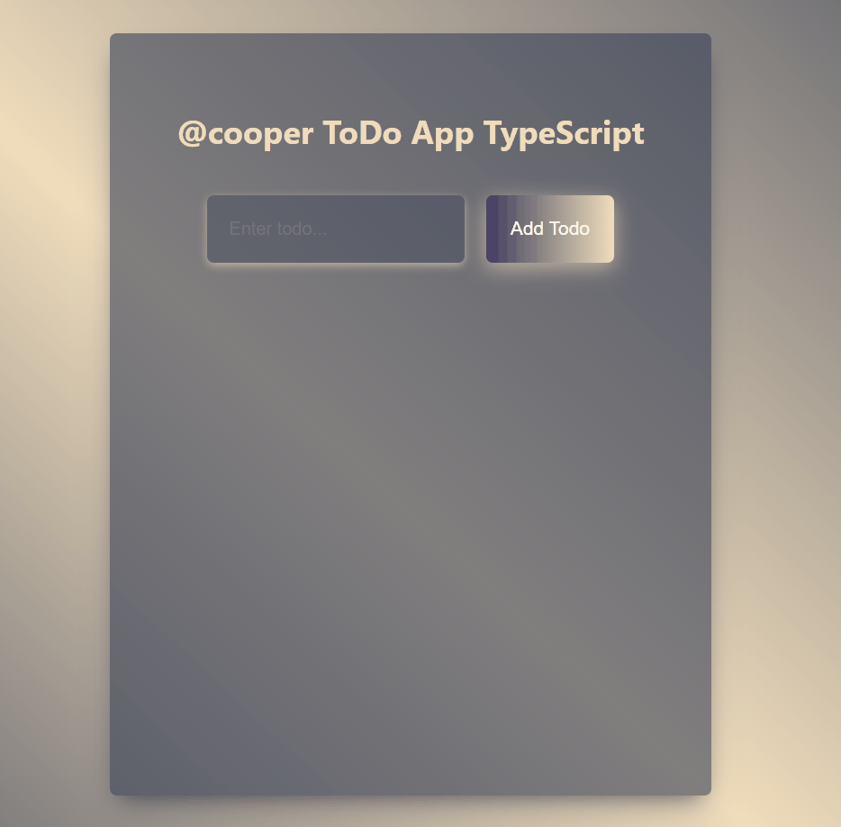

# Project : ToDoApp Typscript

## Check The Live Website ➡️ [Live Website](https://todo-app-react-typscript-rose.vercel.app/)

## Visualization of the Website



## Description

Project aims to create an ToDo App using React Typscript.

## Learning Outcomes

At the end of the project, you will be able to;

- improve coding skills within HTML & CSS & TS & ReactTS.

- use git commands (push, pull, commit, add etc.) and Github as Version Control System.

## Problem Statement

- We are adding a new project to our portfolios. So you and your colleagues have started to work on the project.

## Project Skeleton

```
Project(folder)
|
|----README.md
├── public
│     └── index.html
├── src
│    ├── components
│    │       ├── InputForm.tsx
│    │       ├── ToDoList.tsx
│    │       ├── ToDoListItem.tsx
│    ├── pages
│    │       ├── Home.tsx
│    ├── App.css
│    ├── App.tsx
│    ├── index.tsx
│    ├── react-app-env.d.ts
│    ├── types.d.ts
└── package.json
```

### Dependencies

- react-router-dom@6.3

- axios

- https://mockapi.io/


### Overview

I mastered HTML & CSS & TS & ReactTS features in this project.
You can see the visual representation of the website above.


## Resources

- 🔥 You can use [`mockapi`](https://mockapi.io/projects) for your own work.

## Support

- Open an Issue, I will check it a soon as possible 👀

- Don't forget to show your support by  ⭐ the project!!


## Quick start

- Clone this repo using git clone https://github.com/SkyCooper/TodoAppReactTypscript.git

- Move to the appropriate directory: cd recipe-app.

- Run npm run install in order to install dependencies and clean the git repo.

- Change configurations in /src/config/config.js according to your cosmicjs bucket.

- Run npm run dev to start the project in dev mode.

- Run npm run build to build the project in /dist folder.

- Now you're ready to rumble!

## Contributing

- Fork it (https://github.com/SkyCooper/TodoAppReactTypscript)

- Create your feature branch (git checkout -b feature/fooBar)

- Commit your changes (git commit -am 'Add some fooBar')

- Push to the branch (git push origin feature/fooBar)

- Create a new Pull Request


# <center> ⌛ Happy Coding ✍ </center>
